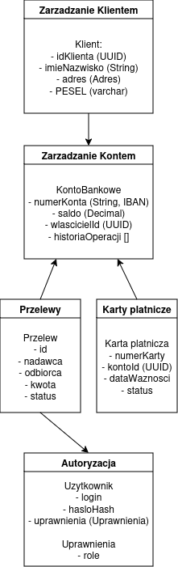

# Domain Driven Design – Model fragmentu aplikacji bankowej

## Opis zadania
Celem projektu jest zamodelowanie fragmentu bezpiecznej aplikacji bankowej z wykorzystaniem zasad Domain Driven Design. Model obejmuje kilka kontekstów, które  tworzą podstawowy ekosystem bankowości elektronicznej: zarządzanie kontami, przelewy, karty płatnicze, zarządzanie klientem oraz autoryzację operacji.  

## Konteksty

| Kontekst | Opis | Główne encje |
|-----------|------|--------------------------|
| Zarządzanie Klientem | Odpowiada za dane osobowe klientów, adresy, weryfikację tożsamości. | `Klient`, `Adres` |
| Zarządzanie Kontem | Obsługuje konta bankowe, saldo, historię operacji. | `KontoBankowe`, `HistoriaOperacji` |
| Przelewy| Realizuje krajowe i wewnętrzne przelewy między kontami, weryfikuje środki i status. | `Przelew` |
| Karty Płatnicze | Zarządza kartami debetowymi i kredytowymi, przypisanymi do kont klientów. | `KartaPlatnicza` |
| Autoryzacja | Zapewnia bezpieczeństwo logowania, autoryzację transakcji, tokeny i OTP. | `Uzytkownik`, `Uprawnienia` |

## Diagram modelu

## Encje, agregaty i obiekty wartości

| Nazwa | Atrybuty | Opis |
|--------|-----------|------|
| Klient | `idKlienta (UUID)`, `imieNazwisko (String)`, `adres (String)`, `PESEL (String)` | Reprezentuje zarejestrowanego klienta banku. |
| Adres | `ulica`, `miasto`, `kodPocztowy` | Obiekt opisujący adres zamieszkania klienta. |
| KontoBankowe | `numerKonta (String)`, `saldo (Decimal)`, `wlascicielId (UUID)`, `historiaOperacji []` | Reprezentuje konto bankowe należące do klienta. |
| Przelew | `idPrzelewu (UUID)`, `nadawcaKonta (String)`, `odbiorcaKonta (String)`, `kwota (Decimal)`, `status (enum)` | Reprezentuje pojedynczy przelew bankowy. |
| KartaPlatnicza | `numerKarty (String)`, `kontoId (UUID)`, `dataWaznosci (Date)`, `status (enum)` | Reprezentuje kartę powiązaną z kontem bankowym. |
| Uzytkownik | `login`, `hasloHash`, `uprawnienia (Uprawnienia)` | Reprezentuje użytkownika systemu. |
| Uprawnienia | `role: Enum(KLIENT, ADMIN)` | Określa poziom dostępu użytkownika w systemie. |

## Przyjęte założenia i ograniczenia

| Założenie | Opis |
|------------|------|
| Format konta | IBAN – `PLxx xxxx xxxx xxxx xxxx xxxx xxxx`. |
| Bezpieczeństwo haseł | Hasła są przechowywane w formie haszowanej. |
| Integralność finansowa | Każda zmiana salda konta musi zostać wykonana cała naraz, bez błędów i bez możliwości przerwania w połowie.|
| Relacja konto-klient | Jeden klient może posiadać wiele kont i kart. |
| Zależności między kontekstami | `Przelewy` i `Karty` korzystają z danych `KontoBankowe`. |
| Uprawnienia | Operacje finansowe wymagają autoryzacji. |
| Karty płatnicze | Karta może być tylko aktywna, zablokowana lub wygasła. |
| Waluta | System działa w PLN. |
| Audyt operacji | Każda operacja finansowa trafia do `historiaOperacji`. |

## Interakcje między kontekstami

1. Klient tworzy konto w kontekście *Zarządzanie Klientem*, które przekazuje dane do *Zarządzania Kontem*.  
2. KontoBankowe może być używane w *Przelewach* lub *Kartach Płatniczych*.  
3. Przelewy aktualizują saldo w kontekście *Zarządzanie Kontem* po pomyślnej autoryzacji.  
4. Autoryzacja weryfikuje użytkownika przed wykonaniem przelewu lub aktywacją karty.  
5. Karty Płatnicze działają jako interfejs płatniczy, który również wymaga autoryzacji użytkownika.  
